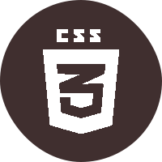

# Ola meu nome e Wallace e este é meu GitHub / Hello my name is Wallace and this is my GitHub #

- 👀 I’m interested in Tecnology area and i like learning more about hardware, because this is my personal interest however i'm studying programming languages
- 🌱 I’m currently learning JavaScript and C, i love search new things in tecnology in different areas.
- 💞️ I’m looking to collaborate on my personal development and then start on the communityes and more, however i pretend to expand for differents areas of my hobbies  

- Observation: I Don't know where is the problem what result in the color lighter then i will remade all again later...

  <a href="https://github.com/wallacetcbrasil">
  
  

 
  
  
  
  
  
  
  
  
  
  
   
  
  
  
  

  

##
  

 
  
  
 	
  
   
  
 

